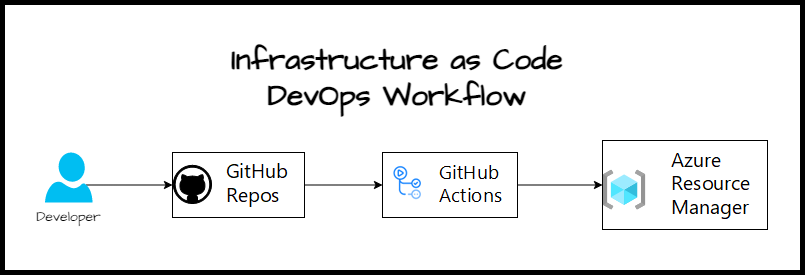

# Service Bus Demo

## Azure Asynchronous Messaging Options

| Technology | Type | Purpose | Model | When to Use |
|:-----------|:-----|:--------|:------|:------------|
|  Queue Storage | Message | Communication Between Application Components | Push-Pull | When you need to store large numbers of messages that can be accessed by a different component of microservice within your application. |
|  Event Grid | Event Distribution (Discrete) | Reactive Programming | Push-Push | When you need to handle discrete events and want to use a push-push model or react to status change within your application. |
|  Event Hub | Event Streaming (Series) | Big Data Pipeline | Push-Pull | When you have the requirement to receive a massive volume of data with high throughput and low latency. It also deals with more data along with events. It's a great option for telemetry and distributed data streaming. |
|  Service Bus | Message | Enterprise Transactional messaging | Push-Pull | When you need to transfer data between applications or organizations. Great option for high-value enterprise messaging where the order is important for processing like in financial transactions. |

### Learn More

- [Asynchronous messaging options](https://learn.microsoft.com/en-us/azure/architecture/guide/technology-choices/messaging)
- [Azure Service Bus vs Event Grid](https://yourazurecoach.com/2021/08/11/azure-service-bus-vs-event-grid/)
- [Message bus vs. Service bus vs. Event hub vs Event grid](https://stackoverflow.com/questions/57740782/message-bus-vs-service-bus-vs-event-hub-vs-event-grid)
- [Asynchronous messaging options - Azure Architecture Center](https://learn.microsoft.com/en-us/azure/architecture/guide/technology-choices/messaging)
- [Azure Event Grid vs Service Bus](https://www.linkedin.com/pulse/azure-event-grid-vs-service-bus-eklavya-gupta)
- [Azure Event Hub Vs Event Grid](https://azurelessons.com/azure-event-hub-vs-event-grid/)
- [Azure Service Bus to Event Grid integration overview](https://learn.microsoft.com/en-us/azure/service-bus-messaging/service-bus-to-event-grid-integration-concept)

## Demo Architecture

### Infrastructure Provisioning with Bicep

### Infrastructure and Data Flow

change here
